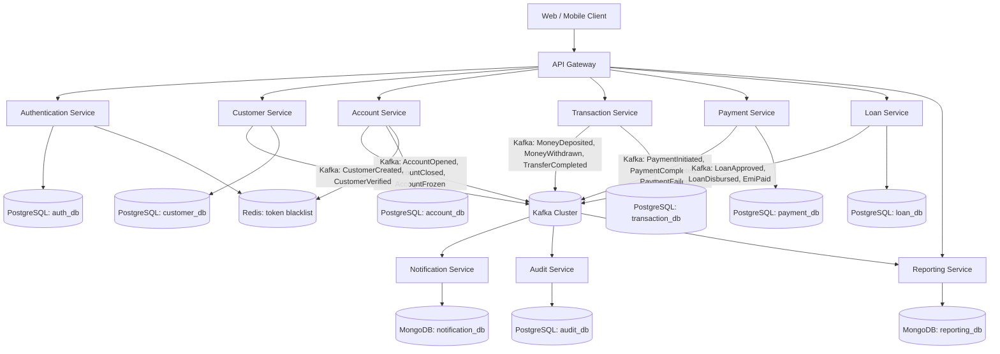
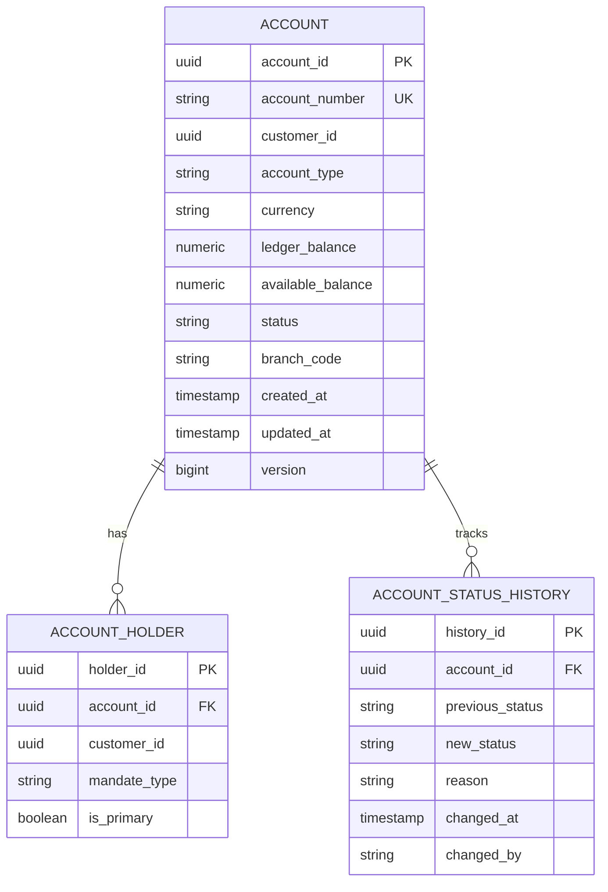
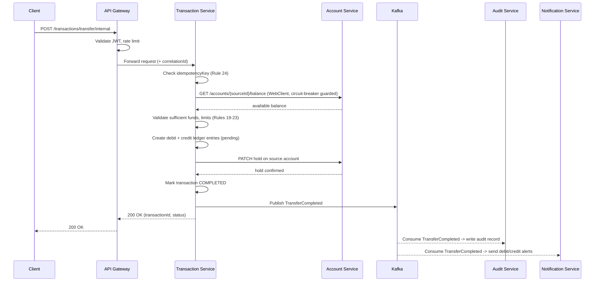
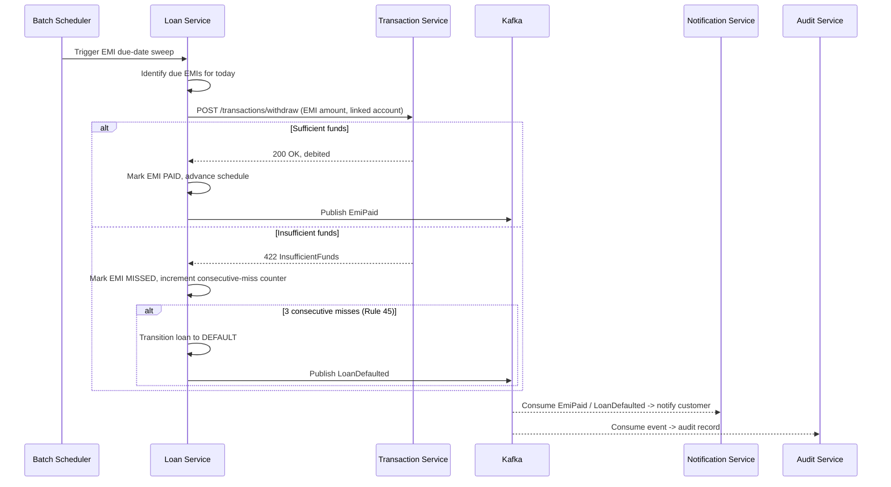
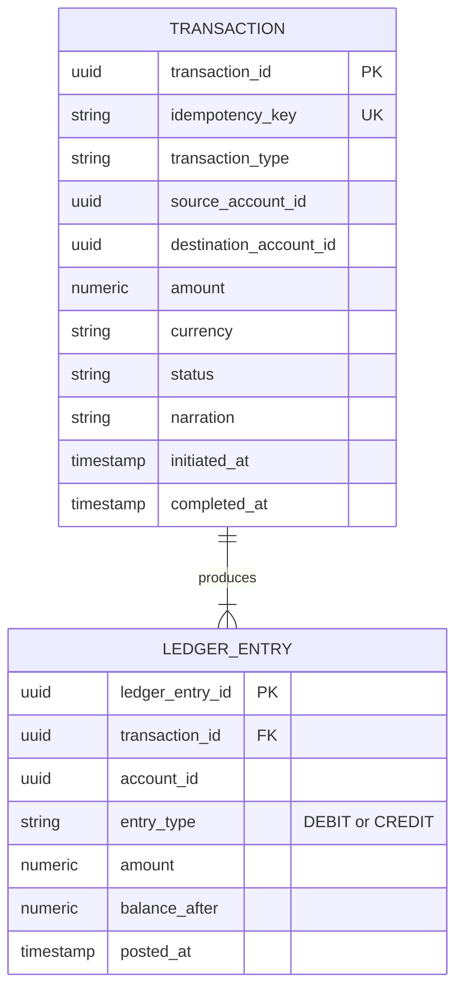
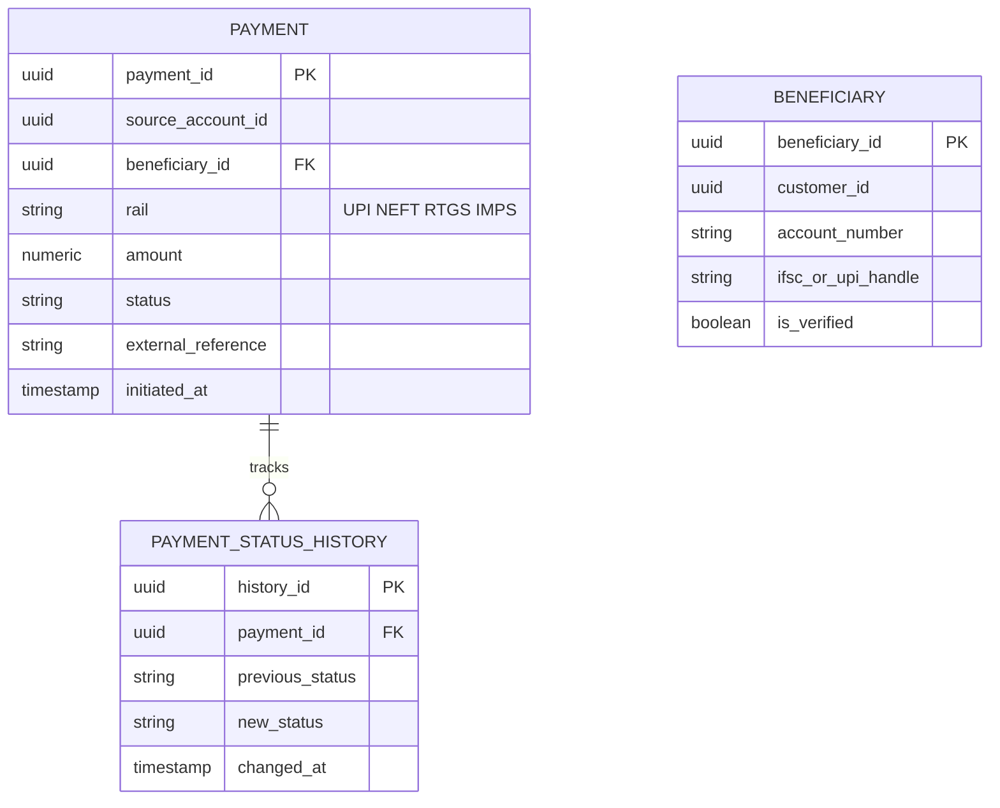
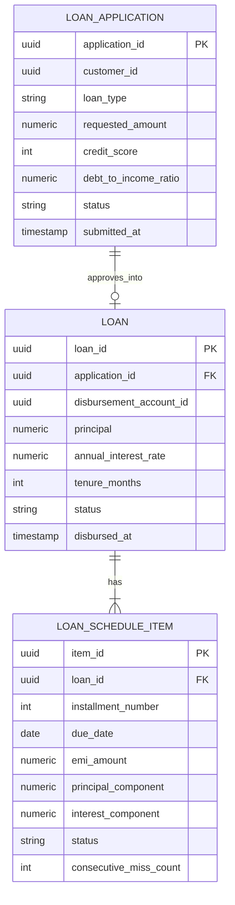
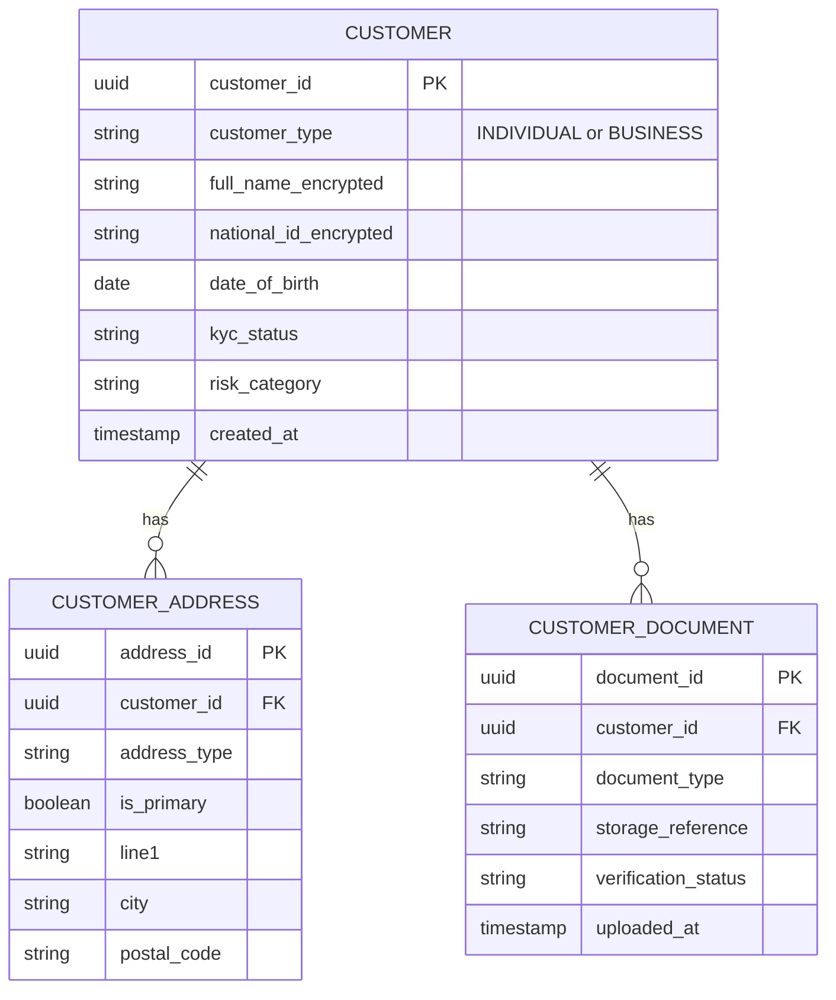
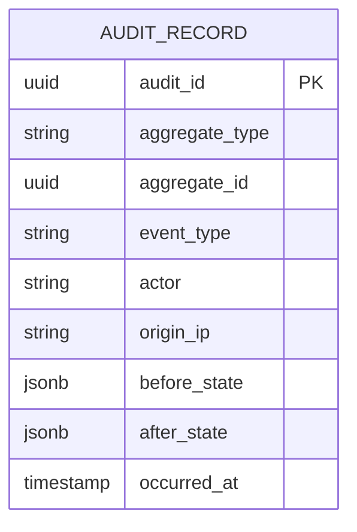
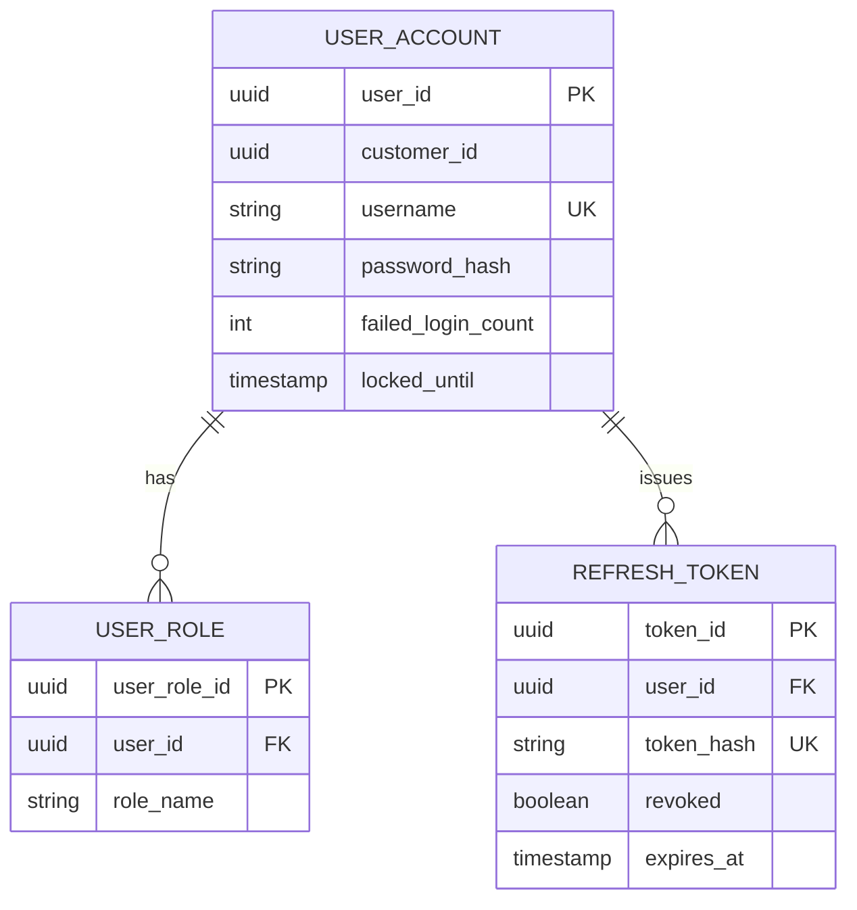

# Senior Java Backend Developer Assignment
## Enterprise Banking Platform — Microservices, DDD & Event-Driven Architecture

**Assignment Code:** SR-JAVA-BANK-2026
**Level:** Senior Software Engineer / Staff Engineer Candidate
**Estimated Duration:** 3–5 weeks (full-time equivalent effort)
**Prepared by:** Office of the Principal Architect, Core Banking Engineering

---

## Table of Contents

1. Executive Summary & Objective
2. Business Context
3. Technology Stack
4. System Overview & High-Level Architecture
5. Microservices Specification
6. Domain-Driven Design Requirements
7. Business Rules Catalogue (60 Rules)
8. API Design Requirements
9. Event-Driven Architecture & Kafka Requirements
10. Database Design Requirements
11. Containerization & Docker Requirements
12. Kubernetes Requirements
13. Security Requirements
14. Performance & Scalability Requirements
15. Exception Handling Requirements
16. Resilience Engineering Requirements
17. Observability & Monitoring Requirements
18. Testing Requirements
19. Git & Collaboration Requirements
20. Project Structure
21. Deliverables
22. Bonus / Stretch Features
23. Evaluation Rubric (100 Marks)
24. Constraints & Submission Rules

---

## 1. Executive Summary & Objective

This assignment evaluates a candidate's ability to design and specify a production-grade **digital banking platform** built as a constellation of independently deployable Java microservices. The candidate is **not required to submit working code for this specification phase** — this document defines the assignment that a candidate would subsequently implement. It is written as the brief a Principal Architect would hand to a senior engineer joining a core banking modernization program.

The platform models the backend of a retail and business bank: customer onboarding and KYC, deposit and current accounts, money movement (internal transfers and external rails such as UPI/NEFT/RTGS/IMPS), lending, notifications, audit, authentication, and reporting. The candidate must demonstrate mastery of Domain-Driven Design, Hexagonal/Clean Architecture, event-driven integration via Kafka, polyglot persistence, defense-in-depth security, and cloud-native operability (Docker/Kubernetes) — all held together by rigorous testing and CI/CD discipline.

The goal is not a toy CRUD exercise. It is a **simulation of the kind of system-of-systems decomposition, business-rule rigor, and operational maturity expected of a Tier-1 bank's engineering organization.**

---

## 2. Business Context

The fictional institution, **Meridian Trust Bank**, is modernizing its monolithic core banking system into independently scalable services. Meridian offers:

- Retail savings and current accounts, joint accounts
- Domestic payments across UPI, NEFT, RTGS, and IMPS rails
- Personal and business loans with EMI-based repayment
- Multi-channel notifications (email, SMS, push)
- Regulatory-grade audit trails and reporting

Regulatory posture: the platform must support **KYC-before-transact** rules, **AML/fraud pattern detection**, **immutable audit logging**, and **data residency and encryption** requirements typical of financial regulators (e.g., RBI-style guidelines, PCI-DSS-adjacent controls for sensitive data, and SOC2-style access logging).

The candidate should treat every business rule and non-functional requirement in this document as if a compliance officer will review the design.

---

## 3. Technology Stack

The implementation (in the subsequent build phase) is mandated to use the following stack. The candidate must justify architectural choices in terms of this stack in the specification/design artifacts requested below.

### Backend
- Java 21 (records, virtual threads, pattern matching for switch)
- Spring Boot 3.x
- Spring WebFlux (reactive services) alongside Spring MVC where synchronous request/response is more appropriate
- Spring Security 6 (method-level and filter-chain security)
- Spring Data JPA (relational aggregates)
- Spring Data R2DBC (reactive relational access where applicable)
- Hibernate 6
- Maven (multi-module reactor build)
- Lombok
- MapStruct (DTO ⇄ domain mapping)

### Architecture
- Microservices, one bounded context per service
- Domain-Driven Design (strategic + tactical patterns)
- Hexagonal Architecture (Ports & Adapters)
- Clean Architecture layering
- Event-Driven Architecture
- CQRS where read/write models diverge materially (Account, Reporting)
- SOLID principles enforced and documented

### Communication
- REST APIs (OpenAPI 3.1 first)
- WebClient for outbound synchronous service-to-service calls (RestTemplate acceptable for legacy-style adapters only, with justification)
- Apache Kafka for asynchronous integration
- Idempotent consumers (dedup keys, idempotency tables)

### Databases
- PostgreSQL (System of record for Customer, Account, Transaction, Payment, Loan)
- MongoDB (Notification templates/history, Reporting read models)
- Redis (caching, rate-limit counters, session/token blacklist)
- Flyway or Liquibase for all relational schema migrations

### Messaging
- Apache Kafka (topics, partitions, consumer groups, DLQ, schema registry)

### Authentication
- JWT (access + refresh tokens)
- OAuth2 (Authorization Code + Client Credentials flows)
- Role-Based Access Control (CUSTOMER, TELLER, BRANCH_MANAGER, COMPLIANCE_OFFICER, ADMIN, SYSTEM)

### Cloud Native
- Docker, Docker Compose (local dev topology)
- Kubernetes (deployment target)
- Helm Charts (bonus)

### Observability
- Spring Boot Actuator, Micrometer
- Prometheus + Grafana
- ELK/EFK stack (bonus)

### Logging
- Structured JSON logging
- Correlation ID propagation across service and Kafka boundaries
- Distributed tracing (OpenTelemetry-compatible)

### Testing
- JUnit 5, Mockito
- Testcontainers (Postgres, Kafka, MongoDB, Redis)
- Integration and contract-level API testing
- Minimum 85% line coverage per service

### Documentation
- Swagger/OpenAPI per service
- Architecture diagrams (Mermaid)
- Sequence diagrams (Mermaid) for key flows
- Deployment guide

### CI/CD
- GitHub Actions or Jenkins pipelines
- SonarQube quality gates
- Code coverage gates
- Static analysis (e.g., SpotBugs/Checkstyle in addition to Sonar)

---

## 4. System Overview & High-Level Architecture

The platform consists of ten core microservices plus supporting infrastructure (API Gateway, Kafka cluster, schema registry, config/service discovery). Communication is a blend of **synchronous REST** (for user-facing request/response flows requiring immediate confirmation) and **asynchronous Kafka events** (for cross-context propagation, eventual consistency, and decoupling).



**Design principle:** every service owns its own database (database-per-service). Cross-context reads happen either via synchronous REST calls guarded by circuit breakers, or by materializing a local read model from consumed Kafka events (CQRS-style), never by reaching into another service's schema.

---

## 5. Microservices Specification

For each microservice below, the candidate must produce: a bounded context description, its aggregates, its public API surface (see Section 8), the events it publishes/consumes (see Section 9), and its schema (see Section 10).

### 5.1 API Gateway
**Bounded context:** Edge/Infrastructure (not a domain context)
- Route requests to downstream services (path-based and header-based routing)
- Authenticate requests by validating JWT signatures before forwarding (delegates issuance to Authentication Service)
- Rate limiting per client/IP/API key (token bucket, Redis-backed)
- Centralized request/response logging with correlation ID injection
- Circuit-breaking on downstream failures (Resilience4j at the gateway layer)

### 5.2 Customer Service
**Bounded context:** Customer Onboarding & Identity
- Customer registration (individual and business customers)
- Customer profile management (contact details, employment info)
- KYC document capture and verification workflow (PAN/Aadhaar-equivalent, proof of address)
- Customer verification status lifecycle: `PENDING → UNDER_REVIEW → VERIFIED / REJECTED`
- Customer address management (multiple addresses: registered, communication, permanent)
- Customer document storage metadata (actual files assumed to live in object storage; service stores references/hashes)
- Customer risk categorization (LOW/MEDIUM/HIGH risk for AML)

### 5.3 Account Service
**Bounded context:** Account Management
- Savings account, current account, joint account opening
- Account status lifecycle: `PENDING_APPROVAL → ACTIVE → DORMANT → FROZEN → CLOSED`
- Account closure with balance sweep validation
- Account freeze/unfreeze (compliance-triggered or customer-requested)
- Interest accrual scheduling for savings accounts (nightly batch-triggered domain event)
- Joint account co-holder authorization rules (single vs. either-or-survivor vs. both-must-sign)

### 5.4 Transaction Service
**Bounded context:** Ledger & Money Movement (core)
- Deposit, withdrawal
- Internal fund transfer (same bank, account-to-account)
- External transfer initiation (delegates settlement rail execution to Payment Service)
- Balance validation (available balance vs. ledger balance, hold amounts)
- Double-entry bookkeeping: every transaction produces a debit leg and a credit leg
- Transaction reversal / compensation flow

### 5.5 Payment Service
**Bounded context:** Payment Rails Integration
- UPI (real-time, 24x7, low value)
- NEFT (batched settlement windows)
- RTGS (real-time, high value, above threshold)
- IMPS (real-time, 24x7, any value within limits)
- Payment status tracking: `INITIATED → PROCESSING → SUCCESS / FAILED / REVERSED`
- Payment history and retrieval
- Beneficiary management and validation

### 5.6 Loan Service
**Bounded context:** Lending
- Loan application intake (personal, business, secured/unsecured)
- Loan approval workflow (auto-decision for low amounts, manual underwriting above threshold)
- EMI calculation (reducing balance method)
- Loan repayment processing (linked to Transaction Service for debit execution)
- Repayment schedule generation and tracking, including foreclosure and prepayment

### 5.7 Notification Service
**Bounded context:** Communication (supporting/generic subdomain)
- Email delivery (templated)
- SMS delivery (templated)
- Push notification delivery
- Kafka consumer for all domain events that require customer communication
- Delivery status tracking and retry-on-failure

### 5.8 Audit Service
**Bounded context:** Compliance & Audit (supporting subdomain, append-only)
- Immutable audit log of all state-changing operations across the platform
- User activity logs (login, profile changes, permission changes)
- Security event logs (failed logins, token revocations, privilege escalations)
- Transaction audit trail (who/what/when/before-after for every ledger-impacting event)

### 5.9 Authentication Service
**Bounded context:** Identity & Access Management
- Login (username/password, and OAuth2 authorization code for third-party channels)
- Registration (delegates customer domain creation to Customer Service via event)
- JWT issuance (short-lived access token, longer-lived refresh token)
- Refresh token rotation and revocation
- OAuth2 client credential flow for service-to-service and partner integrations
- Role and permission management (RBAC)

### 5.10 Reporting Service
**Bounded context:** Analytics & Regulatory Reporting (CQRS read-side)
- Daily transaction/settlement reports
- Monthly account statements and summaries
- Transaction reports by branch/customer/product
- Customer reports (KYC status, risk category distribution)
- Materializes its MongoDB read models purely from consumed Kafka events — never queries other services' write databases directly

---

## 6. Domain-Driven Design Requirements

The candidate must produce a written DDD analysis covering both strategic and tactical design. This is a graded deliverable, not optional background reading.

### 6.1 Strategic Design

**Bounded Contexts.** Define one bounded context per microservice in Section 5. For each, provide a one-paragraph ubiquitous language glossary (5–10 domain terms with precise definitions as used *inside that context only* — e.g., "Balance" means something different in Account context vs. Transaction context).

**Context Mapping.** Produce a context map showing the relationship pattern between every pair of integrated contexts, chosen from: Partnership, Shared Kernel, Customer-Supplier, Conformist, Anti-Corruption Layer, Open Host Service, Published Language, Separate Ways. Example: Transaction Service is a *Customer-Supplier* upstream of Notification Service via a *Published Language* (Kafka event schemas); Payment Service acts as an *Anti-Corruption Layer* translating external rail-specific formats (NPCI UPI format, RBI NEFT format) into the platform's internal `PaymentRequested` domain event.

**Shared Kernel.** Identify the minimal shared kernel (e.g., a `common-domain-primitives` module containing `Money`, `CustomerId`, `AccountNumber` value objects) and justify why it is small and stable enough to share without violating service autonomy.

**Event Storming.** Provide the output of an Event Storming exercise for at least the "Fund Transfer" and "Loan Origination" flows: domain events (orange), commands (blue), aggregates (yellow), policies/reactions (lilac), read models (green), external systems (pink), in chronological swimlane form.

### 6.2 Tactical Design (per bounded context, at minimum for Account, Transaction, Loan)

- **Aggregates** — define the aggregate root and its consistency boundary (e.g., `Account` aggregate root enforces that available balance never goes negative within a single transaction).
- **Entities** — objects with identity and lifecycle inside an aggregate (e.g., `LedgerEntry` inside the `Transaction` aggregate).
- **Value Objects** — immutable, defined by their attributes (e.g., `Money(amount, currency)`, `IFSCCode`, `AccountNumber`, `EmiSchedule`).
- **Repositories** — one repository per aggregate root only; never per entity.
- **Factories** — encapsulate complex creation logic (e.g., `AccountFactory.openJointAccount(...)` enforcing co-holder invariants at creation time).
- **Domain Services** — stateless operations that don't naturally belong to one aggregate (e.g., `InterestAccrualService`, `FraudScoringService`).
- **Application Services** — orchestrate use cases, transaction boundaries, and publish domain events; contain no business logic themselves.
- **Infrastructure Layer** — adapters implementing the ports defined by the domain (JPA repository implementations, Kafka producers/consumers, WebClient-based external adapters).
- **Anti-Corruption Layer** — required explicitly for the Payment Service's integration with external rail simulators/mocks (UPI/NEFT/RTGS/IMPS), translating external schemas to/from the internal domain model.
- **Domain Events** — every state transition that other contexts care about must be modeled as an explicit, versioned domain event (see Section 9).

Candidates must submit a Hexagonal Architecture diagram per service showing: domain core (center), ports (interfaces), and adapters (inbound: REST controllers, Kafka consumers; outbound: JPA/R2DBC repositories, Kafka producers, WebClient calls to other services).

---

## 7. Business Rules Catalogue (60 Rules)

The implementation must enforce all of the following rules at the appropriate architectural layer (domain entity invariant, domain service, or application service policy — the candidate must state which layer enforces each rule in their design doc).

**Customer & KYC**
1. A customer cannot open any account until KYC status is `VERIFIED`.
2. A customer may have at most one `PRIMARY` registered address at any time.
3. Business customers require an additional company registration document not required for individuals.
4. A customer flagged `HIGH_RISK` requires enhanced due diligence review every 12 months.
5. Duplicate customer detection must run on PAN/national-ID equivalent + date of birth before registration completes.
6. A rejected KYC application may be resubmitted a maximum of 3 times within 90 days before manual escalation.
7. Customers under 18 may only hold a guardian-linked minor savings account with withdrawal limits.
8. Customer PII fields (national ID, date of birth) must be encrypted at rest.

**Account Management**
9. Minimum balance for a savings account is ₹1,000 (or configurable per account variant); falling below triggers a penalty fee event.
10. Current accounts have no minimum balance requirement but require a linked business KYC.
11. A joint account requires explicit mandate type (`EITHER_OR_SURVIVOR`, `JOINTLY`, `FORMER_OR_SURVIVOR`) at opening.
12. An account cannot be closed while it has a non-zero balance; balance must be swept or withdrawn first.
13. An account cannot be closed while it has an active linked loan with outstanding EMIs.
14. A frozen account rejects all debit operations but may still accept credits.
15. An account becomes `DORMANT` after 24 months of no customer-initiated transaction.
16. Reactivating a dormant account requires fresh KYC re-verification if more than 5 years dormant.
17. Maximum of 4 joint holders per joint account.
18. Interest on savings accounts accrues daily but is credited quarterly.

**Transactions**
19. Withdrawal is rejected if it would take available balance below the minimum balance requirement.
20. Available balance = ledger balance − sum of holds/liens − sum of pending debit transactions.
21. Daily cumulative transfer limit per customer is ₹2,00,000 for non-premium accounts.
22. Single transaction maximum for internal transfer is ₹5,00,000 without additional step-up authentication.
23. Any transaction above ₹50,000 requires step-up authentication (OTP/2FA) even if within daily limits.
24. Duplicate transaction detection: identical amount + same source + same destination + same idempotency key within 60 seconds is rejected as a duplicate.
25. Every transaction must complete its full save-and-publish cycle within a 10-second timeout, after which it's marked `TIMED_OUT` and reversed.
26. Withdrawals from a `FROZEN` or `CLOSED` account are always rejected regardless of balance.
27. Every debit transaction must have a matching credit transaction (double-entry integrity) before the transaction is marked `COMPLETED`.
28. A failed transaction must never leave a partial ledger entry — it must be fully rolled back or fully compensated via a reversal entry.
29. Currency mismatch between source and destination account currency is rejected (no implicit FX conversion in v1).
30. Transaction reversal is only permitted within 24 hours of the original transaction unless manually approved by compliance.

**Payments (UPI/NEFT/RTGS/IMPS)**
31. RTGS is only permitted for amounts ≥ ₹2,00,000; amounts below must use NEFT/IMPS/UPI.
32. NEFT transactions are processed in settlement batches (half-hourly windows) and are not instantaneous.
33. RTGS and NEFT are unavailable during designated banking holidays and outside operating hours (per rail-specific calendar), while UPI/IMPS remain 24x7.
34. UPI transaction maximum per transaction is ₹1,00,000 (typical NPCI-style cap) unless per-bank override configured.
35. A failed payment must be retried automatically up to 3 times with exponential backoff before being marked `FAILED` and notifying the customer.
36. Beneficiary must be added and (if required by rail) cooling-period-verified before first transfer above a configurable threshold.
37. Payment status must never regress (e.g., `SUCCESS` can never transition back to `PROCESSING`).
38. A payment stuck in `PROCESSING` beyond the rail's max settlement SLA triggers an automatic reconciliation job.

**Loans**
39. Loan eligibility requires a minimum credit score threshold and a debt-to-income ratio below 50%.
40. Loan applications above a configurable amount require manual underwriter approval; below it, auto-decisioning is permitted.
41. EMI is calculated using the reducing-balance method with the agreed annual interest rate.
42. A customer with any existing loan in `DEFAULT` status cannot apply for a new loan.
43. Loan disbursement can only occur into a `VERIFIED` and `ACTIVE` account belonging to the same customer.
44. Prepayment/foreclosure recalculates the remaining schedule and may incur a foreclosure charge per product terms.
45. Three consecutive missed EMIs move a loan into `DEFAULT` status and trigger a collections workflow event.
46. Loan approval requires KYC verification no older than 12 months.

**Fraud / AML / Compliance**
47. More than 5 failed transaction attempts within 10 minutes on one account triggers a temporary account lock and fraud review.
48. Transactions structured just under reporting thresholds in rapid succession (structuring pattern) are flagged for AML review.
49. Any single transaction ≥ ₹10,00,000 is automatically reported to the Audit/Compliance service regardless of outcome.
50. A sudden change in transaction geography/device fingerprint inconsistent with customer history raises a fraud risk score.
51. Blocked/sanctioned-list customers (per a maintained denylist) cannot transact at all, even for credits, pending compliance review.

**Notifications & Audit**
52. Every state-changing operation (account, transaction, payment, loan) must emit a corresponding audit event before the operation is considered complete.
53. Notification delivery failures must be retried at least twice before being logged as permanently failed (not silently dropped).
54. Audit logs are immutable — no update or delete operation is permitted on audit records, only appends.
55. Security-sensitive events (password change, role change, failed login) must always be logged with actor, timestamp, and origin IP.

**Authentication & Access**
56. Access tokens expire after 15 minutes; refresh tokens expire after 7 days and are single-use (rotate-on-use).
57. Five consecutive failed login attempts locks the account for 15 minutes.
58. A `TELLER` role may view but not approve loans; only `BRANCH_MANAGER` or above may approve loans above the auto-decision threshold.
59. Refresh tokens must be revocable server-side (e.g., on logout, password change, or detected compromise) via a Redis-backed blacklist.
60. Role changes take effect on next token refresh, not retroactively on already-issued tokens (documented as an accepted eventual-consistency tradeoff).

*(Candidates are encouraged, and will be scored favorably, for identifying and documenting additional rules beyond this list during their domain analysis.)*

---

## 8. API Design Requirements

For **every** microservice in Section 5, the candidate must produce a full API specification including:

- Full REST endpoint list with HTTP method, path, and purpose
- Request payload schema (JSON) with field-level validation rules (required/optional, type, format, min/max, regex where relevant)
- Response payload schema for success cases, including pagination envelope for list endpoints
- Error response schema (a consistent `ProblemDetail`-style RFC 7807 error body across all services)
- HTTP status code mapping (200/201/202/204 for success variants; 400/401/403/404/409/422/429 for client errors; 500/502/503/504 for server errors)
- At least one fully worked Swagger/OpenAPI example (request + response) per endpoint

### 8.1 Example — Account Service endpoint table (candidate must produce equivalents for all 10 services)

| Method | Path | Purpose | Auth Role |
|---|---|---|---|
| POST | `/api/v1/accounts` | Open a new account | CUSTOMER, TELLER |
| GET | `/api/v1/accounts/{accountId}` | Retrieve account details | CUSTOMER (own), TELLER, BRANCH_MANAGER |
| GET | `/api/v1/accounts?customerId=` | List accounts for a customer | CUSTOMER (own), TELLER |
| PATCH | `/api/v1/accounts/{accountId}/status` | Freeze/unfreeze/close | BRANCH_MANAGER, COMPLIANCE_OFFICER |
| GET | `/api/v1/accounts/{accountId}/balance` | Get current available/ledger balance | CUSTOMER (own), TELLER |

### 8.2 Sample Request/Response Contract (Open Account)

```json
POST /api/v1/accounts
{
  "customerId": "c8f3a1e2-11ab-4e2a-9a1e-6b2f4d7c9a10",
  "accountType": "SAVINGS",
  "currency": "INR",
  "initialDeposit": 5000.00,
  "branchCode": "MTB0001",
  "jointHolders": []
}
```

```json
201 Created
{
  "accountId": "9b2e1c44-3f7a-4b21-8b3d-1a9f0c7e2d55",
  "accountNumber": "MTB0001000045213",
  "status": "PENDING_APPROVAL",
  "createdAt": "2026-07-27T09:15:00Z"
}
```

```json
422 Unprocessable Entity
{
  "type": "https://meridiantrust.com/errors/kyc-not-verified",
  "title": "KYC Verification Required",
  "status": 422,
  "detail": "Customer c8f3a1e2-11ab-4e2a-9a1e-6b2f4d7c9a10 has KYC status PENDING; account opening requires VERIFIED.",
  "instance": "/api/v1/accounts",
  "correlationId": "6f1a2b3c-...-req"
}
```

The candidate must replicate this level of rigor — full request/response/error triad — for every endpoint of every service, including Payment rail-specific endpoints (`/payments/upi`, `/payments/neft`, `/payments/rtgs`, `/payments/imps`), Loan EMI schedule endpoints, and Reporting query endpoints.

---

## 9. Event-Driven Architecture & Kafka Requirements

### 9.1 Topic Design

Candidates must define, at minimum, the following topics with partition counts and key strategy:

| Topic | Key | Partitions (suggested) | Producer |
|---|---|---|---|
| `customer.events` | customerId | 6 | Customer Service |
| `account.events` | accountId | 12 | Account Service |
| `transaction.events` | accountId | 24 | Transaction Service |
| `payment.events` | paymentId | 12 | Payment Service |
| `loan.events` | loanId | 6 | Loan Service |
| `notification.commands` | customerId | 6 | multiple (fan-in) |
| `audit.events` | aggregateId | 12 | multiple (fan-in) |
| `*.events.DLQ` | original key | 3 each | Kafka Streams / consumer error handler |

Partitioning must be keyed to preserve **per-aggregate ordering** (e.g., all events for one account land on the same partition) while allowing parallelism across aggregates.

### 9.2 Required Event Catalogue (minimum set — candidate must add more as designed)

`CustomerCreated`, `CustomerVerified`, `CustomerKycRejected`, `AccountOpened`, `AccountActivated`, `AccountFrozen`, `AccountClosed`, `MoneyDeposited`, `MoneyWithdrawn`, `TransferInitiated`, `TransferCompleted`, `TransferFailed`, `PaymentInitiated`, `PaymentCompleted`, `PaymentFailed`, `LoanApplied`, `LoanApproved`, `LoanRejected`, `LoanDisbursed`, `EmiPaid`, `LoanDefaulted`, `NotificationSent`, `NotificationFailed`, `AuditCreated`, `FraudFlagRaised`.

### 9.3 Event Schema & Versioning

- Every event carries an envelope: `eventId`, `eventType`, `eventVersion`, `occurredAt`, `correlationId`, `aggregateId`, `payload`.
- Schemas registered in a schema registry (Avro or JSON Schema); breaking changes require a new `eventVersion` and a compatibility mode (`BACKWARD` at minimum).
- Consumers must tolerate unknown additional fields (forward-compatible deserialization).

### 9.4 Producer & Consumer Configuration

- Producers: `acks=all`, idempotent producer enabled (`enable.idempotence=true`), bounded retries with backoff.
- Consumers: manual offset commit after successful processing (at-least-once delivery), consumer groups scoped per service+purpose (e.g., `notification-service-account-events`).
- **Idempotent consumers**: every consumer persists a processed-event-id ledger (or uses natural business idempotency keys) to guard against duplicate delivery/reprocessing.
- **Exactly-once semantics**: candidate must discuss where true EOS (Kafka transactions, read-process-write pattern) is warranted (ledger-critical paths) vs. where at-least-once + idempotent consumer is sufficient (notifications).
- **Dead Letter Queue**: after N retryable failures, message routed to a `.DLQ` topic with failure metadata; a replay tool/process must be described.
- **Event replay**: describe how a consumer can be reset to replay from a given offset/timestamp for disaster recovery or new-consumer bootstrapping.
- **Ordering**: guaranteed only within a partition; cross-aggregate ordering is explicitly out of scope and must be documented as such.

### 9.5 Outbox Pattern (recommended, see bonus section for mandatory CDC variant)

Because each service persists to its own relational database, publishing an event and committing the DB write must be atomic. Candidates should describe (implementation optional unless attempting the bonus) an outbox table + relay process to avoid dual-write inconsistency.

---

## 10. Database Design Requirements

For every microservice, the candidate must produce:

- Full schema definition (tables, columns, types, nullability)
- Primary/foreign key relationships and referential integrity rules
- Indexes (including composite indexes for common query patterns, e.g., `(customer_id, status)` on accounts)
- Constraints (check constraints for enums/status values, unique constraints, e.g., unique `account_number`)
- An ER diagram description (Mermaid `erDiagram` syntax is acceptable)
- Sample seed records for local development/testing

### 10.1 Example — Account Service schema (candidate must produce equivalents for all relational services)



Notes required from the candidate: why `ledger_balance` and `available_balance` are separate columns (holds/liens), why optimistic locking (`version`) is used on the aggregate root row to prevent lost updates under concurrent transactions, and indexing strategy for `customer_id` and `status` lookups.

The candidate must produce equivalent schemas for `customer_db`, `transaction_db` (with a `ledger_entries` double-entry table), `payment_db`, `loan_db` (with `loan_schedule` table), `audit_db` (append-only, no update/delete grants), and `auth_db` (`users`, `roles`, `refresh_tokens`), plus MongoDB document shapes for `notification_db` and `reporting_db` (denormalized read models).

---

## 11. Containerization & Docker Requirements

- A `Dockerfile` per microservice (multi-stage build: Maven build stage → minimal JRE runtime image, non-root user).
- A root-level `docker-compose.yml` orchestrating: all 10 services, Kafka + Zookeeper (or KRaft mode), PostgreSQL (one instance/db or one per service — candidate must justify choice), MongoDB, Redis, and a schema registry.
- Explicit Docker networks isolating, e.g., the data-tier network from the public-facing gateway network.
- Named volumes for all stateful services (Postgres data, MongoDB data, Kafka logs).
- Health checks defined for every container (`HEALTHCHECK` directive or Compose `healthcheck:` block) tied to each service's Actuator `/actuator/health` endpoint.
- Startup ordering via `depends_on` with `condition: service_healthy`, not naive sleep-based waits.

---

## 12. Kubernetes Requirements

For every microservice, provide manifests (or Helm templates, see bonus) covering:

- **Deployment** — replica count, rolling update strategy, resource requests/limits
- **Service** — ClusterIP for internal services, appropriate type for the Gateway
- **Ingress** — routing rules, TLS termination for the API Gateway
- **ConfigMap** — externalized non-secret configuration (Kafka bootstrap servers, feature flags)
- **Secret** — DB credentials, JWT signing keys, OAuth2 client secrets
- **HorizontalPodAutoscaler** — CPU/memory-based scaling for Transaction and Payment services in particular (highest throughput expectation)
- **PersistentVolume/PersistentVolumeClaim** — for any stateful workloads run in-cluster (if not using managed external DBs)
- **Readiness Probe** — must fail if the service can't reach its DB/Kafka dependencies
- **Liveness Probe** — must restart a hung pod without cascading restarts platform-wide
- **Namespace** — logical separation (e.g., `banking-core`, `banking-data`, `banking-observability`)
- **Resource Limits** — sane defaults per service tier (Gateway/Transaction get more headroom than Reporting)

---

## 13. Security Requirements

- **JWT** — RS256-signed access tokens (15-min TTL) and refresh tokens (7-day TTL, rotate-on-use, revocable).
- **OAuth2** — Authorization Code flow for interactive clients; Client Credentials flow for service-to-service and partner API access.
- **Refresh Token** — stored hashed server-side; Redis-backed revocation/blacklist checked at the Gateway.
- **Password Encryption** — BCrypt (or Argon2) with per-user salt; no reversible encryption of passwords ever.
- **HTTPS** — TLS termination at ingress; internal service-to-service traffic should also be encrypted (mTLS discussed as a stretch goal).
- **RBAC** — method-level `@PreAuthorize` enforcement mapped to the roles defined in Section 3; every endpoint's required role(s) must be documented in Section 8's API tables.
- **API Security** — input validation on every DTO (Bean Validation annotations), output encoding, strict content-type enforcement.
- **CSRF** — not applicable to stateless JWT APIs (documented rationale required), but applicable and enforced for any cookie-based session flows if used.
- **CORS** — explicit allow-list of origins per environment; no wildcard origins in production configuration.
- **SQL Injection Prevention** — parameterized queries only via JPA/R2DBC; no string-concatenated queries; candidate must document how native queries (if any) are safely parameterized.
- **XSS Prevention** — output encoding on any rendered content (primarily relevant to admin/reporting UIs, if built); JSON API responses inherently mitigate but must still avoid reflecting unescaped user input in error messages.
- **Rate Limiting** — implemented at the Gateway (per-client) and additionally at the Payment Service (per-account, to blunt automated fraud attempts).
- **Sensitive Data Encryption** — PII (national ID, DOB) and payment instrument data encrypted at rest (column-level or transparent data encryption), with key management strategy documented (e.g., KMS-issued data encryption keys).

---

## 14. Performance & Scalability Requirements

- **Caching** — Redis used for: account balance read-through cache (short TTL, invalidated on write), rate-limit counters, token blacklist, reference data (branch codes, product catalog).
- **Pagination** — all list endpoints must support cursor or offset-based pagination with sane default and maximum page sizes.
- **Batch Processing** — NEFT settlement batching, nightly interest accrual, EMI due-date sweep, all modeled as scheduled batch jobs (Spring `@Scheduled` or a dedicated batch framework) with idempotent re-run safety.
- **Connection Pooling** — HikariCP tuned pool sizes per service based on expected concurrency; R2DBC connection pool sizing documented separately from JDBC pools.
- **Reactive Programming** — WebFlux used where I/O-bound fan-out matters most (Gateway, Notification, Payment rail calls); candidate must justify which services stay on the traditional Spring MVC/JPA blocking stack and why (often: Transaction Service, for strict transactional/ACID guarantees).
- **Backpressure** — Kafka consumer `max.poll.records` tuning and reactive stream backpressure (`Flux`/`Mono` operators) documented for high-throughput consumers (Notification, Audit).
- **Thread Management** — Java 21 virtual threads considered for blocking I/O-heavy services; documented tradeoffs vs. traditional platform thread pools.
- **Performance Benchmarks** — target SLAs stated explicitly, e.g., p99 latency < 300ms for balance inquiry, p99 < 800ms for internal transfer, Kafka consumer lag < 5s under normal load.

---

## 15. Exception Handling Requirements

- **Global Exception Handler** — `@RestControllerAdvice` per service producing the RFC 7807 `ProblemDetail` error contract defined in Section 8.
- **Custom Exceptions** — a clear exception hierarchy: `DomainException` (base) → `BusinessRuleViolationException`, `InsufficientFundsException`, `AccountNotFoundException`, `DuplicateTransactionException`, etc.
- **Business Exceptions** — mapped to `422 Unprocessable Entity` or `409 Conflict` as appropriate, never leaking stack traces to the client.
- **Validation Exceptions** — Bean Validation failures mapped to `400 Bad Request` with a field-level error list.
- **Retry Logic** — declarative retry (Resilience4j `@Retry`) for transient downstream failures (network blips), not for business-rule rejections.
- **Circuit Breaker** — protecting calls to Payment rail integrations and any inter-service synchronous calls (e.g., Transaction Service calling Account Service to validate account status).
- **Fallback** — graceful degradation strategy per protected call (e.g., if Notification Service is down, the triggering event remains in Kafka for later redelivery rather than failing the originating transaction).
- **Timeout Handling** — explicit timeouts on every WebClient call and Kafka consumer processing budget, tied back to Business Rule #25.

---

## 16. Resilience Engineering Requirements

Using **Resilience4j**, the candidate must apply and document configuration for:

- **Circuit Breaker** — sliding window size, failure rate threshold, wait duration in open state, per integration point.
- **Retry** — max attempts, backoff strategy (exponential with jitter recommended), and which exceptions are retryable vs. not.
- **Rate Limiter** — per-client and per-endpoint limits, especially on Payment initiation endpoints.
- **Bulkhead** — thread pool or semaphore isolation so that a slow downstream (e.g., a flaky external payment rail simulator) cannot starve threads needed for unrelated requests.
- **Timeout** — explicit per-call timeouts distinct from the global HTTP client timeout.
- **Fallback** — documented fallback behavior for every guarded call, distinguishing "fail open" vs. "fail closed" decisions (e.g., fraud-check service down → fail closed, block the transaction, rather than fail open).

---

## 17. Observability & Monitoring Requirements

- **Micrometer** — standardized metrics naming convention across all services (`{service}.{domain}.{action}.{outcome}`).
- **Prometheus** — scrape endpoints exposed via Actuator; alerting rules for error rate, latency SLO breach, and Kafka consumer lag.
- **Grafana Dashboards** — at least one dashboard per service plus a platform-wide "golden signals" dashboard (latency, traffic, errors, saturation).
- **Distributed Tracing** — trace context propagated across REST calls and through Kafka message headers, so a single customer-initiated transfer can be traced end-to-end through Transaction → Payment → Notification → Audit.
- **Correlation ID** — generated at the Gateway if not already present, propagated via header (`X-Correlation-Id`) and Kafka message headers, included in every structured log line.
- **Health Endpoints** — `/actuator/health` with custom indicators for DB, Kafka, and Redis connectivity per service.
- **Application Metrics** — business-relevant custom metrics (transactions/sec, payment success rate by rail, loan approval rate).
- **Kafka Metrics** — consumer lag, DLQ message rate, producer error rate.
- **Database Metrics** — connection pool saturation, slow query counts.

---

## 18. Testing Requirements

- **Unit Testing** — JUnit 5 + Mockito for domain logic in isolation (aggregates, domain services); no Spring context loaded.
- **Integration Testing** — Testcontainers-backed tests spinning up real PostgreSQL, Kafka, MongoDB, and Redis instances per service's test suite.
- **API Testing** — MockMvc (blocking controllers) or WebTestClient (WebFlux controllers) covering the full request/response/error contract from Section 8.
- **Kafka Testing** — embedded/Testcontainers Kafka verifying producer serialization, consumer deserialization, idempotency handling, and DLQ routing on poison messages.
- **Repository Testing** — Testcontainers-backed JPA/R2DBC repository tests validating constraints, indexes behave as designed, and Flyway/Liquibase migrations apply cleanly from scratch.
- **Controller Testing** — security rules (role-based access denial) explicitly tested, not just happy paths.
- **Service Testing** — application service orchestration logic tested with mocked ports.
- **Minimum 85% line coverage** per service, enforced as a CI quality gate via SonarQube/JaCoCo.

---

## 19. Git & Collaboration Requirements

- **Branch Strategy** — Git Flow (`main`, `develop`, `feature/*`, `release/*`, `hotfix/*`) or trunk-based with feature flags; candidate must pick one and justify it for a 10-service monorepo-or-polyrepo choice (also to be justified).
- **Commit Standards** — Conventional Commits (`feat:`, `fix:`, `refactor:`, `test:`, `docs:`) with scoped service prefixes (e.g., `feat(account-service): add joint account mandate validation`).
- **Pull Requests** — template requiring: description, linked business rule(s) addressed, test evidence, and a rollback plan.
- **Code Review Checklist** — explicit checklist covering: DDD layering respected (no leaking infrastructure concerns into domain), no direct cross-service DB access, all new endpoints documented in OpenAPI, all new business rules covered by tests, security review for any new PII field.

---

## 20. Project Structure

Each microservice must follow a consistent Hexagonal/Clean Architecture folder layout. Example shown for Account Service; all other services must mirror this structure.

```
account-service/
├── pom.xml
├── Dockerfile
├── src/
│   ├── main/
│   │   ├── java/com/meridiantrust/account/
│   │   │   ├── domain/
│   │   │   │   ├── model/            # Aggregates, Entities, Value Objects
│   │   │   │   ├── event/            # Domain events (pre-serialization)
│   │   │   │   ├── service/          # Domain services
│   │   │   │   ├── factory/          # Aggregate factories
│   │   │   │   └── port/             # Repository & outbound port interfaces
│   │   │   ├── application/
│   │   │   │   ├── usecase/          # Application services / use case orchestration
│   │   │   │   ├── command/          # Command objects
│   │   │   │   └── query/            # Query objects (CQRS read side)
│   │   │   ├── infrastructure/
│   │   │   │   ├── persistence/
│   │   │   │   │   ├── entity/       # JPA entities (distinct from domain model)
│   │   │   │   │   ├── repository/   # Spring Data repository implementations
│   │   │   │   │   └── mapper/       # MapStruct domain <-> JPA entity mappers
│   │   │   │   ├── messaging/
│   │   │   │   │   ├── producer/     # Kafka producers
│   │   │   │   │   ├── consumer/     # Kafka consumers
│   │   │   │   │   └── schema/       # Event schema classes
│   │   │   │   ├── client/           # WebClient adapters to other services
│   │   │   │   └── config/           # Spring configuration
│   │   │   ├── adapter/
│   │   │   │   ├── rest/
│   │   │   │   │   ├── controller/
│   │   │   │   │   ├── dto/
│   │   │   │   │   └── mapper/       # MapStruct DTO <-> domain mappers
│   │   │   ├── security/             # Security config, filters
│   │   │   └── exception/            # Exception hierarchy + global handler
│   │   └── resources/
│   │       ├── application.yml
│   │       └── db/migration/         # Flyway migrations
│   └── test/
│       └── java/com/meridiantrust/account/
│           ├── domain/               # Pure unit tests
│           ├── application/          # Use case tests with mocked ports
│           ├── infrastructure/       # Testcontainers-backed integration tests
│           └── adapter/              # Controller/API tests
```

---

## 21. Deliverables

The candidate must submit:

1. **Source Code** — one repository (mono- or poly-repo, justified) containing all 10 microservices plus shared kernel module, buildable via a single Maven reactor command.
2. **README** — per service and platform-level, covering purpose, local run instructions, and configuration.
3. **Swagger/OpenAPI documentation** — generated and committed (or generated-on-build) per service, aggregated at the Gateway if feasible.
4. **Postman Collection** — covering every documented endpoint with example requests, environment variables for auth tokens.
5. **Architecture Diagrams** — system-level (Section 4 style), per-service Hexagonal diagrams, and context map (Section 6).
6. **Sequence Diagrams** — for at least: Customer Onboarding, Account Opening, Internal Fund Transfer, External Payment (any one rail), Loan Application-to-Disbursement.
7. **Deployment Guide** — step-by-step Docker Compose local setup and Kubernetes cluster deployment instructions.
8. **Docker Configuration** — all Dockerfiles and the Compose file (Section 11).
9. **Kubernetes Configuration** — all manifests/Helm charts (Section 12).
10. **Test Reports** — coverage reports demonstrating the 85% minimum, plus a summary of test strategy.
11. **CI/CD Pipeline** — working GitHub Actions or Jenkins pipeline definitions, including SonarQube gate.
12. **Monitoring Dashboard** — exported Grafana dashboard JSON for at least the platform golden-signals dashboard.

---

## 22. Bonus / Stretch Features

These are not required for a passing grade but earn extra credit and demonstrate staff-level thinking:

- **Saga Pattern** — orchestration or choreography-based saga for the multi-step Loan Disbursement flow (approve → open disbursement hold → transfer → confirm) with compensating transactions.
- **Outbox Pattern** — implemented (not just described) transactional outbox for Transaction and Payment services.
- **CDC using Debezium** — replacing the polling-based outbox relay with log-based CDC into Kafka.
- **Distributed Transactions** — discussion of why 2PC is avoided and how sagas/eventual consistency substitute for it.
- **Multi-tenancy** — schema-per-tenant or discriminator-column strategy discussion for supporting multiple bank brands on one platform.
- **API Gateway Authentication enhancements** — full OAuth2 Authorization Server (e.g., Spring Authorization Server) instead of a simplified JWT issuer.
- **Service Discovery** — Eureka or Kubernetes-native discovery instead of static config.
- **Config Server** — Spring Cloud Config for centralized, environment-aware configuration.
- **Spring Cloud** — Gateway, Circuit Breaker, and Sleuth/Micrometer Tracing integration end-to-end.
- **gRPC** — for latency-sensitive internal calls (e.g., Transaction → Account balance check) as an alternative to REST.
- **GraphQL** — a federated read API for the Reporting Service.
- **Event Sourcing** — full event-sourced Transaction aggregate instead of state-stored, with snapshotting.
- **Reactive Streams end-to-end** — fully non-blocking pipeline from Gateway through to R2DBC for at least one service.
- **ElasticSearch** — full-text/audit log search capability layered on top of the Audit Service.
- **AI-powered Fraud Detection** — a scoring model (even a simple rules-plus-ML-stub) consuming the transaction event stream in near-real-time.
- **OpenTelemetry** — full trace/metric/log correlation via the OTel collector instead of Micrometer alone.

---

## 23. Evaluation Rubric (100 Marks)

| Section | Marks | What is assessed |
|---|---|---|
| Architecture (overall system decomposition, hexagonal layering, clean boundaries) | 20 | Bounded context correctness, no leaky abstractions, sensible sync/async split |
| DDD Implementation | 15 | Correct use of aggregates, value objects, repositories, factories, domain events, context mapping |
| Microservices Design | 15 | Service autonomy, database-per-service discipline, API contract quality |
| Kafka Integration | 10 | Topic design, idempotent consumers, DLQ, versioning, ordering guarantees |
| Database Design | 10 | Schema correctness, indexing, constraints, migration discipline |
| Security | 10 | JWT/OAuth2 correctness, RBAC enforcement, encryption of sensitive data |
| Testing | 10 | Coverage, use of Testcontainers, meaningful assertions over trivial ones |
| Docker/Kubernetes | 5 | Correctness and completeness of manifests, health probes, resource limits |
| Code Quality | 5 | SOLID adherence, readability, SonarQube gate passing |
| Documentation | 10 | Completeness and clarity of diagrams, README, deployment guide, API docs |
| **Total** | **100** | |

**Passing threshold:** 70/100, with no individual section below 50% of its allocated marks (i.e., a candidate cannot pass by excelling in coding while submitting no security design).

---

## 24. Constraints & Submission Rules

- This document is a **specification only**; the candidate's task is to design against it and then implement — no reference implementation is provided.
- The assignment must not be simplified from what is described above; all 10 microservices, the full business rules catalogue, and all listed cross-cutting concerns are in scope.
- Real banking terminology (as used throughout this document) must be used consistently in code, API naming, and documentation.
- All architecture and sequence diagrams in submissions should use Mermaid syntax for portability and version-control-friendliness.
- Submissions are expected to reflect **senior/staff-level judgment**: tradeoffs must be explicitly stated and justified, not left implicit.
- Estimated effort: **3–5 weeks** for a single senior engineer working at a sustainable pace; candidates working in pairs should expect proportionally increased scope expectations, not proportionally reduced time.

---

*End of Assignment Specification — Meridian Trust Bank Core Engineering.*

---

## Appendix A — Full Endpoint Specifications (All Remaining Services)

The endpoint-level rigor demonstrated for Account Service in Section 8.1–8.2 must be replicated for every service below. Endpoint tables are provided as the mandatory minimum surface; candidates should add supporting endpoints (e.g., health, admin) as needed but must not omit any listed here.

### A.1 API Gateway

| Method | Path | Purpose | Auth Role |
|---|---|---|---|
| ANY | `/api/v1/**` | Proxy to downstream service based on path prefix | Varies by downstream route |
| GET | `/gateway/routes` | Introspect active routing table | ADMIN |
| GET | `/actuator/health` | Gateway health | Public (internal network only) |

Validation: every proxied request must carry a valid `Authorization: Bearer <jwt>` header except for `/api/v1/auth/login` and `/api/v1/auth/register`, which are explicitly excluded from the auth filter.

### A.2 Customer Service

| Method | Path | Purpose | Auth Role |
|---|---|---|---|
| POST | `/api/v1/customers` | Register a new customer | Public (pre-auth) / SYSTEM |
| GET | `/api/v1/customers/{customerId}` | Retrieve customer profile | CUSTOMER (own), TELLER, BRANCH_MANAGER |
| PUT | `/api/v1/customers/{customerId}` | Update profile fields | CUSTOMER (own), TELLER |
| POST | `/api/v1/customers/{customerId}/addresses` | Add an address | CUSTOMER (own), TELLER |
| POST | `/api/v1/customers/{customerId}/documents` | Attach a KYC document reference | CUSTOMER (own), TELLER |
| POST | `/api/v1/customers/{customerId}/kyc/verify` | Trigger/complete KYC verification | COMPLIANCE_OFFICER |
| PATCH | `/api/v1/customers/{customerId}/risk-category` | Update AML risk category | COMPLIANCE_OFFICER |

Sample payload — KYC verification decision:
```json
POST /api/v1/customers/{customerId}/kyc/verify
{
  "decision": "APPROVED",
  "reviewedBy": "compliance.officer@meridiantrust.com",
  "documentsReviewed": ["doc-9931", "doc-9932"],
  "riskCategory": "LOW",
  "notes": "PAN and address proof verified against registry."
}
```
Validation rules: `decision` restricted to `APPROVED|REJECTED|NEEDS_MORE_INFO`; `documentsReviewed` must reference document IDs that exist and belong to the customer; rejecting more than 3 times must return `409 Conflict` with escalation guidance per Business Rule #6.

### A.3 Transaction Service

| Method | Path | Purpose | Auth Role |
|---|---|---|---|
| POST | `/api/v1/transactions/deposit` | Deposit funds into an account | TELLER, SYSTEM |
| POST | `/api/v1/transactions/withdraw` | Withdraw funds from an account | CUSTOMER (own), TELLER |
| POST | `/api/v1/transactions/transfer/internal` | Internal account-to-account transfer | CUSTOMER (own), TELLER |
| GET | `/api/v1/transactions/{transactionId}` | Retrieve transaction detail | CUSTOMER (own), TELLER |
| GET | `/api/v1/transactions?accountId=` | List transactions for an account (paginated) | CUSTOMER (own), TELLER |
| POST | `/api/v1/transactions/{transactionId}/reverse` | Reverse a completed transaction | BRANCH_MANAGER, COMPLIANCE_OFFICER |

Sample payload — internal transfer:
```json
POST /api/v1/transactions/transfer/internal
{
  "idempotencyKey": "b7e2-...-client-generated",
  "sourceAccountId": "9b2e1c44-3f7a-4b21-8b3d-1a9f0c7e2d55",
  "destinationAccountId": "1a4f2b91-77cd-4a02-9e11-3f5c8a0b2d44",
  "amount": 15000.00,
  "currency": "INR",
  "narration": "Rent payment July"
}
```
Validation: `idempotencyKey` required and must be unique per Business Rule #24; `amount` must be > 0 and ≤ daily/single-transaction limits (Rules #21–23); source and destination currencies must match (Rule #29); step-up auth token required in header if `amount` ≥ ₹50,000 (Rule #23), else `428 Precondition Required`.

### A.4 Payment Service

| Method | Path | Purpose | Auth Role |
|---|---|---|---|
| POST | `/api/v1/payments/upi` | Initiate a UPI payment | CUSTOMER (own) |
| POST | `/api/v1/payments/neft` | Initiate an NEFT payment | CUSTOMER (own), TELLER |
| POST | `/api/v1/payments/rtgs` | Initiate an RTGS payment | CUSTOMER (own), TELLER |
| POST | `/api/v1/payments/imps` | Initiate an IMPS payment | CUSTOMER (own) |
| GET | `/api/v1/payments/{paymentId}` | Retrieve payment status | CUSTOMER (own), TELLER |
| GET | `/api/v1/payments?accountId=` | Payment history (paginated) | CUSTOMER (own), TELLER |
| POST | `/api/v1/payments/beneficiaries` | Add a beneficiary | CUSTOMER (own) |

Sample payload — RTGS initiation, illustrating rail-specific validation (Rule #31):
```json
POST /api/v1/payments/rtgs
{
  "sourceAccountId": "9b2e1c44-3f7a-4b21-8b3d-1a9f0c7e2d55",
  "beneficiaryId": "ben-4471",
  "amount": 350000.00,
  "purposeCode": "P1401",
  "remarks": "Property advance"
}
```
```json
422 Unprocessable Entity
{
  "type": "https://meridiantrust.com/errors/rail-amount-violation",
  "title": "Amount Below RTGS Minimum",
  "status": 422,
  "detail": "RTGS requires amount >= 200000.00; use NEFT/IMPS/UPI for lower amounts.",
  "instance": "/api/v1/payments/rtgs"
}
```

### A.5 Loan Service

| Method | Path | Purpose | Auth Role |
|---|---|---|---|
| POST | `/api/v1/loans/applications` | Submit a loan application | CUSTOMER (own), TELLER |
| GET | `/api/v1/loans/applications/{applicationId}` | Retrieve application status | CUSTOMER (own), TELLER, BRANCH_MANAGER |
| POST | `/api/v1/loans/applications/{applicationId}/decision` | Approve/reject application | BRANCH_MANAGER (above threshold), SYSTEM (auto-decision) |
| GET | `/api/v1/loans/{loanId}/schedule` | Retrieve EMI repayment schedule | CUSTOMER (own), TELLER |
| POST | `/api/v1/loans/{loanId}/repayments` | Record an EMI repayment | CUSTOMER (own), TELLER, SYSTEM |
| POST | `/api/v1/loans/{loanId}/foreclose` | Foreclose/prepay remaining loan | CUSTOMER (own), TELLER |

Validation highlights: application intake enforces Rules #39–40 (credit score, DTI, amount thresholds triggering manual review); repayment recording enforces Rule #45 (three consecutive misses → `DEFAULT`); foreclosure recalculates schedule per Rule #44 and returns the recalculated schedule in the response body.

### A.6 Notification Service

| Method | Path | Purpose | Auth Role |
|---|---|---|---|
| POST | `/api/v1/notifications/send` | Direct send (admin/testing use) | ADMIN, SYSTEM |
| GET | `/api/v1/notifications/{notificationId}` | Retrieve delivery status | CUSTOMER (own), ADMIN |
| GET | `/api/v1/notifications?customerId=` | Notification history | CUSTOMER (own), ADMIN |

Note: the primary ingestion path for this service is the Kafka consumer (Section 9), not the REST API; the REST API exists mainly for status queries and administrative/manual sends.

### A.7 Audit Service

| Method | Path | Purpose | Auth Role |
|---|---|---|---|
| GET | `/api/v1/audit/logs` | Query audit logs (filterable by actor, aggregate, date range) | COMPLIANCE_OFFICER, ADMIN |
| GET | `/api/v1/audit/logs/{auditId}` | Retrieve single audit record | COMPLIANCE_OFFICER, ADMIN |
| GET | `/api/v1/audit/security-events` | Query security-specific events | COMPLIANCE_OFFICER, ADMIN |

Note: this service exposes **no write endpoints** — audit records are created exclusively via Kafka consumption per Business Rule #54 (immutability).

### A.8 Authentication Service

| Method | Path | Purpose | Auth Role |
|---|---|---|---|
| POST | `/api/v1/auth/register` | Register credentials (linked to a Customer) | Public |
| POST | `/api/v1/auth/login` | Authenticate and issue tokens | Public |
| POST | `/api/v1/auth/refresh` | Rotate refresh token, issue new access token | Public (valid refresh token required) |
| POST | `/api/v1/auth/logout` | Revoke refresh token | CUSTOMER, TELLER, etc. (any authenticated) |
| POST | `/api/v1/auth/roles/{userId}` | Assign/update roles | ADMIN |
| GET | `/api/v1/auth/oauth2/authorize` | OAuth2 Authorization Code entry point | Public |
| POST | `/api/v1/auth/oauth2/token` | Token exchange endpoint (auth code / client credentials) | Public / SYSTEM clients |

Sample payload — login:
```json
POST /api/v1/auth/login
{ "username": "jane.doe", "password": "•••••••••" }
```
```json
200 OK
{
  "accessToken": "eyJhbGciOiJSUzI1NiIs...",
  "refreshToken": "8f21c0...rotating-opaque-token",
  "tokenType": "Bearer",
  "expiresIn": 900
}
```
```json
423 Locked
{
  "type": "https://meridiantrust.com/errors/account-locked",
  "title": "Account Temporarily Locked",
  "status": 423,
  "detail": "5 consecutive failed attempts detected; retry after 15 minutes.",
  "instance": "/api/v1/auth/login"
}
```

### A.9 Reporting Service

| Method | Path | Purpose | Auth Role |
|---|---|---|---|
| GET | `/api/v1/reports/daily` | Daily transaction/settlement report | BRANCH_MANAGER, COMPLIANCE_OFFICER, ADMIN |
| GET | `/api/v1/reports/monthly/{customerId}` | Monthly customer statement | CUSTOMER (own), TELLER |
| GET | `/api/v1/reports/transactions` | Ad-hoc transaction report (filterable) | BRANCH_MANAGER, COMPLIANCE_OFFICER |
| GET | `/api/v1/reports/customers/kyc-status` | KYC status distribution report | COMPLIANCE_OFFICER, ADMIN |

All Reporting Service responses are served from MongoDB read models materialized asynchronously from Kafka; endpoints must document their **staleness bound** (e.g., "reflects events consumed up to 60 seconds ago") since this is a CQRS eventually-consistent read side.


---

## Appendix B — Required Sequence Diagrams

Candidates must produce sequence diagrams at this level of detail for each flow named in Section 21 (Deliverables). Two worked examples are provided below as the expected standard; the remaining three (Customer Onboarding, External Payment, Loan Application-to-Disbursement) must be produced by the candidate in equivalent detail.

### B.1 Internal Fund Transfer



### B.2 Loan EMI Repayment with Default Detection



Candidates must ensure their remaining diagrams (Customer Onboarding, External Payment, Loan Application-to-Disbursement) show: the synchronous call chain, every Kafka publish/consume hop, and at least one explicit failure/compensation branch, matching the rigor above.

---

## Appendix C — Extended Database Schemas (All Relational & Document Stores)

### C.1 Transaction Service — `transaction_db`


Indexes: composite `(source_account_id, initiated_at DESC)` and `(destination_account_id, initiated_at DESC)` for statement queries; unique index on `idempotency_key`. Constraint: `CHECK (amount > 0)`; a database-level trigger or application invariant enforces that every `TRANSACTION` in `COMPLETED` status has exactly two `LEDGER_ENTRY` rows (one debit, one credit) summing to zero net.

### C.2 Payment Service — `payment_db`


Index on `(source_account_id, initiated_at DESC)`; unique constraint on `(customer_id, account_number, ifsc_or_upi_handle)` for beneficiaries to prevent duplicates.

### C.3 Loan Service — `loan_db`



### C.4 Customer Service — `customer_db`



### C.5 Audit Service — `audit_db` (append-only)


Database role permissions: the service's application user is granted `SELECT, INSERT` only — no `UPDATE` or `DELETE` grants exist at the database level, enforcing Business Rule #54 defense-in-depth (not just application-layer enforcement).

### C.6 Authentication Service — `auth_db`



### C.7 Notification Service — `notification_db` (MongoDB, document shape)

```json
{
  "_id": "ObjectId",
  "customerId": "uuid",
  "channel": "EMAIL | SMS | PUSH",
  "templateId": "string",
  "renderedContent": "string",
  "status": "QUEUED | SENT | FAILED",
  "retryCount": 0,
  "sourceEvent": { "eventType": "TransferCompleted", "eventId": "uuid" },
  "createdAt": "ISODate",
  "sentAt": "ISODate"
}
```

### C.8 Reporting Service — `reporting_db` (MongoDB, denormalized read models)

```json
{
  "_id": "ObjectId",
  "reportType": "MONTHLY_STATEMENT",
  "customerId": "uuid",
  "period": "2026-06",
  "openingBalance": 45210.00,
  "closingBalance": 51830.00,
  "transactions": [
    { "date": "2026-06-03", "type": "CREDIT", "amount": 15000.00, "narration": "Salary" }
  ],
  "materializedFromEventOffsets": { "transaction.events": 184213 },
  "generatedAt": "ISODate"
}
```


---

## Appendix D — Platform-Wide Error Code Catalogue

Every service must map its business exceptions onto a shared, platform-wide error taxonomy so that client applications can build generic error-handling UI without per-service special-casing. The `type` field in every `ProblemDetail` response must resolve to a documented URI under `https://meridiantrust.com/errors/{code}`. Candidates must produce the full catalogue; a representative starter set follows.

| Code | HTTP Status | Meaning | Originating Service(s) |
|---|---|---|---|
| `kyc-not-verified` | 422 | Operation requires verified KYC | Account, Transaction, Payment, Loan |
| `insufficient-funds` | 422 | Available balance insufficient for requested debit | Transaction, Payment, Loan |
| `account-not-found` | 404 | Referenced account does not exist | Account, Transaction, Payment |
| `account-frozen` | 409 | Operation not permitted on a frozen account | Account, Transaction, Payment |
| `duplicate-transaction` | 409 | Idempotency key collision within dedup window | Transaction |
| `daily-limit-exceeded` | 422 | Cumulative daily transfer/payment limit breached | Transaction, Payment |
| `step-up-auth-required` | 428 | Additional authentication required for high-value operation | Transaction, Payment |
| `rail-amount-violation` | 422 | Amount outside the permitted band for the chosen payment rail | Payment |
| `beneficiary-not-verified` | 422 | Beneficiary cooling period not yet satisfied | Payment |
| `loan-ineligible` | 422 | Credit score or DTI ratio fails eligibility policy | Loan |
| `existing-default` | 409 | Customer has an existing loan in DEFAULT status | Loan |
| `validation-error` | 400 | Request body fails schema/field validation | All |
| `unauthorized` | 401 | Missing or invalid authentication credential | All (via Gateway) |
| `forbidden` | 403 | Authenticated but insufficient role/permission | All |
| `account-locked` | 423 | Too many failed login attempts | Authentication |
| `rate-limited` | 429 | Client exceeded configured rate limit | Gateway, Payment |
| `downstream-unavailable` | 503 | A required downstream dependency's circuit breaker is open | All |
| `conflict-version-mismatch` | 409 | Optimistic locking conflict on aggregate update | Account, Loan |

Candidates should extend this table with additional codes as their domain model surfaces new business exceptions (Section 15), and must ensure no service throws an undocumented error code in production paths.

---

## Appendix E — Sample Configuration Reference

To anchor the expected level of configuration rigor, a representative (non-exhaustive) `application.yml` outline is provided below for the Transaction Service. Candidates must produce equivalent, environment-aware configuration for every service, externalizing all secrets (never committed in plaintext) via Kubernetes Secrets or a config server (see bonus features).

```yaml
spring:
  application:
    name: transaction-service
  datasource:
    url: jdbc:postgresql://${DB_HOST}:5432/transaction_db
    hikari:
      maximum-pool-size: 20
      minimum-idle: 5
  kafka:
    bootstrap-servers: ${KAFKA_BOOTSTRAP_SERVERS}
    producer:
      acks: all
      enable-idempotence: true
      retries: 5
    consumer:
      group-id: transaction-service-consumer
      enable-auto-commit: false
      max-poll-records: 100
  flyway:
    locations: classpath:db/migration
    baseline-on-migrate: true

resilience4j:
  circuitbreaker:
    instances:
      accountServiceClient:
        sliding-window-size: 20
        failure-rate-threshold: 50
        wait-duration-in-open-state: 10s
  retry:
    instances:
      accountServiceClient:
        max-attempts: 3
        wait-duration: 200ms
  ratelimiter:
    instances:
      transferEndpoint:
        limit-for-period: 50
        limit-refresh-period: 1s

management:
  endpoints:
    web:
      exposure:
        include: health,info,prometheus,metrics
  endpoint:
    health:
      probes:
        enabled: true
  tracing:
    sampling:
      probability: 1.0

app:
  business-rules:
    daily-transfer-limit: 200000.00
    single-transfer-max-without-step-up: 500000.00
    step-up-threshold: 50000.00
    duplicate-detection-window-seconds: 60
    transaction-timeout-seconds: 10
```

Candidates must document, per service, which values are safe as `ConfigMap` entries versus which must live in `Secret` resources (database credentials, JWT signing keys, third-party rail API keys), and how configuration differs across `local`, `staging`, and `production` Spring profiles.

---

## Appendix F — Non-Functional Requirements Summary

For quick reference during implementation and review, the following table consolidates the key non-functional targets scattered throughout this specification.

| Category | Requirement |
|---|---|
| Availability | 99.9% for Gateway, Transaction, Payment services |
| Latency (p99) | Balance inquiry < 300ms; internal transfer < 800ms; payment initiation < 1.5s (excluding external rail SLA) |
| Throughput | Transaction Service must sustain ≥ 500 TPS sustained, ≥ 1500 TPS burst |
| Data Durability | No committed ledger entry may ever be lost; Kafka topics for financial events use replication factor ≥ 3 |
| Recovery Point Objective | ≤ 5 minutes for core banking databases |
| Recovery Time Objective | ≤ 30 minutes for any single service outage |
| Test Coverage | ≥ 85% line coverage per service, enforced in CI |
| Security Review | Every new PII field or new external integration requires a documented security review before merge |
| Auditability | 100% of state-changing operations must produce a corresponding immutable audit record |


---

## Appendix G — Suggested 4-Week Delivery Plan

While the assignment does not mandate a specific schedule, candidates unsure how to sequence 3–5 weeks of work may use the following phased breakdown as a planning aid. Deviating from it is acceptable and even expected for stronger candidates who reorder based on their own risk assessment.

**Week 1 — Foundation & Domain Modeling**
- Finalize bounded context map and ubiquitous language glossaries (Section 6.1)
- Stand up the shared kernel module (`Money`, `CustomerId`, `AccountNumber`, common event envelope)
- Build Customer Service and Authentication Service end-to-end (these unblock everything downstream)
- Establish Docker Compose baseline (Postgres, Kafka, Redis, MongoDB) and CI skeleton

**Week 2 — Core Ledger**
- Build Account Service and Transaction Service, including double-entry ledger invariants
- Implement idempotent consumers and the outbox/dual-write mitigation strategy
- Write the bulk of Testcontainers-backed integration tests for these two services, since all later services depend on their correctness

**Week 3 — Payments & Lending**
- Build Payment Service including the four-rail Anti-Corruption Layer
- Build Loan Service including EMI scheduling and the default-detection state machine
- Wire Resilience4j circuit breakers/retries/bulkheads across all synchronous inter-service calls introduced so far

**Week 4 — Cross-Cutting Concerns & Hardening**
- Build Notification, Audit, and Reporting services (all primarily event-driven consumers)
- Complete Kubernetes manifests, Grafana dashboards, and distributed tracing wiring
- Fill remaining test coverage gaps to reach the 85% threshold
- Finalize all documentation deliverables (Section 21) and, time permitting, attempt one or two bonus features (Section 22)

**Week 5 (buffer, if used)** — Reserved for bonus features, load testing against the stated performance targets (Appendix F), and polish of documentation/diagrams.

---

## Appendix H — Ubiquitous Language Glossary (Starter Set)

Candidates must expand this per bounded context as required by Section 6.1. A starter set disambiguating terms that are easy to conflate across contexts is provided below.

| Term | Meaning in Account Context | Meaning in Transaction Context | Meaning in Payment Context |
|---|---|---|---|
| **Balance** | The account's current state (`ledgerBalance`, `availableBalance`) as owned and exposed by Account Service | Not owned here — Transaction Service only *reads* balance via a port to validate sufficiency; it never mutates it directly | Not applicable — Payment Service defers balance validation entirely to Transaction Service |
| **Hold** | A temporary reduction of available balance without a ledger movement, tracked as account state | The mechanism by which a pending transaction reserves funds before completion | N/A |
| **Status** | Account lifecycle state (`ACTIVE`, `FROZEN`, `CLOSED`, etc.) | Transaction lifecycle state (`PENDING`, `COMPLETED`, `FAILED`, `REVERSED`) — an entirely distinct state machine from Account status | Payment lifecycle state (`INITIATED`, `PROCESSING`, `SUCCESS`, `FAILED`) — distinct again, and rail-specific |
| **Reversal** | N/A — accounts are not reversed, only frozen/closed | A compensating transaction that produces offsetting ledger entries | A rail-initiated return of funds (e.g., an NEFT return), modeled as an inbound event, not a local reversal command |

This table exists specifically to illustrate why a shared `Status` enum across contexts would be a modeling error — each context's `Status` value object is deliberately distinct and must not be unified into a shared kernel type, even though the temptation to do so is common among engineers new to DDD.

---

## Appendix I — Candidate FAQ

**Q: Must every microservice use both JPA and R2DBC?**
No. The stack lists both because different services should make different, justified choices. Transaction Service (needs strict transactional guarantees) is a strong candidate for JPA; Notification/Reporting read paths are strong candidates for reactive/R2DBC or MongoDB reactive drivers. State your reasoning per service.

**Q: Is a monorepo or polyrepo expected?**
Either is acceptable. State and justify your choice in the README; the rubric rewards the justification, not the specific choice.

**Q: Do external payment rails (NPCI/RBI systems) need to be really integrated?**
No — these must be simulated/mocked (e.g., a local stub service or WireMock-based simulator) behind the Anti-Corruption Layer described in Section 6.2. The architectural seam is what's being evaluated, not a real regulatory integration.

**Q: What happens if a candidate cannot complete all 10 services in the time available?**
Partial submissions are graded against the rubric as submitted. Candidates should prioritize architectural correctness and depth on fewer services over shallow coverage of all ten — this is stated explicitly because it is the single most common failure mode seen in prior cohorts of this assignment.

**Q: Can Lombok and MapStruct be swapped for alternatives?**
No — these are fixed stack requirements per Section 3, primarily to standardize the review process across candidates, not because alternatives are architecturally inferior.


---

## Appendix J — Worked Event Schema Examples

To remove ambiguity about the envelope structure required in Section 9.3, fully worked JSON examples for a representative sample of the event catalogue are provided. Candidates must produce the remaining schemas (Section 9.2) in this same structure, registering each in the schema registry with an explicit `eventVersion`.

```json
// AccountOpened (account.events, key = accountId)
{
  "eventId": "0c9d2f3a-1234-4a11-9c1a-2b3d4e5f6a70",
  "eventType": "AccountOpened",
  "eventVersion": 1,
  "occurredAt": "2026-07-27T09:15:03Z",
  "correlationId": "6f1a2b3c-req-abcd",
  "aggregateId": "9b2e1c44-3f7a-4b21-8b3d-1a9f0c7e2d55",
  "payload": {
    "accountNumber": "MTB0001000045213",
    "customerId": "c8f3a1e2-11ab-4e2a-9a1e-6b2f4d7c9a10",
    "accountType": "SAVINGS",
    "currency": "INR",
    "initialDeposit": 5000.00,
    "branchCode": "MTB0001"
  }
}
```

```json
// TransferCompleted (transaction.events, key = sourceAccountId)
{
  "eventId": "3ad0f1e2-9988-4c11-a2b3-1122334455aa",
  "eventType": "TransferCompleted",
  "eventVersion": 1,
  "occurredAt": "2026-07-27T10:02:41Z",
  "correlationId": "9f8e7d6c-req-xyz9",
  "aggregateId": "9b2e1c44-3f7a-4b21-8b3d-1a9f0c7e2d55",
  "payload": {
    "transactionId": "4b6c8d0e-2f1a-4c3d-8e5f-6a7b8c9d0e1f",
    "sourceAccountId": "9b2e1c44-3f7a-4b21-8b3d-1a9f0c7e2d55",
    "destinationAccountId": "1a4f2b91-77cd-4a02-9e11-3f5c8a0b2d44",
    "amount": 15000.00,
    "currency": "INR",
    "narration": "Rent payment July"
  }
}
```

```json
// LoanDefaulted (loan.events, key = loanId)
{
  "eventId": "77aa88bb-0011-4c22-9d33-4455667788ee",
  "eventType": "LoanDefaulted",
  "eventVersion": 1,
  "occurredAt": "2026-07-27T06:00:12Z",
  "correlationId": "batch-emi-sweep-20260727",
  "aggregateId": "loan-5591",
  "payload": {
    "customerId": "c8f3a1e2-11ab-4e2a-9a1e-6b2f4d7c9a10",
    "consecutiveMissedInstallments": 3,
    "outstandingPrincipal": 218430.55,
    "lastPaymentDate": "2026-05-01"
  }
}
```

```json
// FraudFlagRaised (audit.events, key = aggregateId)
{
  "eventId": "aa11bb22-cc33-4d44-9e55-ff6677889900",
  "eventType": "FraudFlagRaised",
  "eventVersion": 1,
  "occurredAt": "2026-07-27T10:03:00Z",
  "correlationId": "9f8e7d6c-req-xyz9",
  "aggregateId": "9b2e1c44-3f7a-4b21-8b3d-1a9f0c7e2d55",
  "payload": {
    "ruleTriggered": "STRUCTURING_PATTERN",
    "riskScore": 78,
    "relatedTransactionIds": ["4b6c8d0e-...", "1c2d3e4f-..."],
    "recommendedAction": "MANUAL_REVIEW"
  }
}
```

DLQ envelope wrapper — messages routed to `<topic>.DLQ` after exhausting retries must additionally carry failure metadata:

```json
{
  "originalTopic": "transaction.events",
  "originalPartition": 7,
  "originalOffset": 184213,
  "failureReason": "Deserialization error: unknown eventVersion 3, consumer supports up to 2",
  "failedAt": "2026-07-27T10:04:00Z",
  "retryAttempts": 3,
  "originalMessage": { "...": "the full original event payload" }
}
```

---

## Appendix K — Reviewer Scoring Guide (Rubric Sub-Criteria)

To support consistent grading across multiple reviewers, each rubric section from Section 23 is broken into sub-criteria below.

**Architecture (20 marks)**
- Bounded contexts map cleanly to microservices with no obvious context-splitting errors (6)
- Hexagonal/Clean layering respected — domain has zero framework imports (6)
- Sync vs. async communication choices are justified, not arbitrary (4)
- Database-per-service is strictly honored, no cross-service schema access (4)

**DDD Implementation (15 marks)**
- Aggregates correctly scope their consistency boundary (4)
- Value objects used for money, identifiers, and other conceptually immutable data (3)
- Domain events are the mechanism for cross-context communication, not shared DB triggers (4)
- Context map correctly identifies relationship patterns (Partnership, ACL, etc.) (4)

**Microservices Design (15 marks)**
- Each service is independently deployable and independently testable (5)
- API contracts are stable, versioned, and consistent in error shape (5)
- Service boundaries avoid chatty synchronous chains where an event would suffice (5)

**Kafka Integration (10 marks)**
- Idempotent consumer implementation is real, not just claimed in prose (4)
- DLQ and retry strategy is implemented and testable (3)
- Partitioning/key strategy preserves necessary ordering (3)

**Database Design (10 marks)**
- Schema constraints enforce, not just document, business invariants (4)
- Indexing strategy matches the query patterns actually used by the API (3)
- Migrations are reproducible from a clean database (3)

**Security (10 marks)**
- RBAC is enforced at the method level, not just at the Gateway (4)
- Sensitive fields are genuinely encrypted at rest, not merely masked in logs (3)
- Token lifecycle (issue/refresh/revoke) is correctly implemented end-to-end (3)

**Testing (10 marks)**
- Coverage threshold met with meaningful assertions (5)
- Testcontainers used for genuine integration confidence, not mocked-out shortcuts (5)

**Docker/Kubernetes (5 marks)**
- All manifests apply cleanly to a real cluster (3)
- Probes correctly reflect actual service health, not hardcoded 200s (2)

**Code Quality (5 marks)**
- SOLID violations are rare and, where present, justified (3)
- SonarQube quality gate passes with no critical/blocker issues (2)

**Documentation (10 marks)**
- Diagrams are accurate to the actual submitted design, not aspirational (5)
- README and deployment guide allow a reviewer to run the system from scratch without assistance (5)


---

## Appendix L — Idempotency & Concurrency Control Deep Dive

Given how central Business Rules #24, #27, and #28 are to the integrity of the platform, candidates must document (and implement) both of the following mechanisms explicitly, not merely assert that "idempotency is handled."

**Client-supplied idempotency keys (write-path APIs).** Every mutating endpoint that moves money (deposit, withdraw, transfer, payment initiation) must accept a client-generated `idempotencyKey`. The service persists a row in an `idempotency_ledger` table keyed on `(idempotency_key, endpoint)` before performing the operation; a retried request with the same key short-circuits to return the original response rather than re-executing the operation. The candidate must document the key's TTL (recommended: 24 hours) and what happens when a key is reused with a *different* payload (must be rejected with `409 Conflict`, not silently accepted).

**Kafka consumer idempotency (event-path consumers).** Every consumer that has a side effect (writing to its own DB, calling an external system, sending a notification) must maintain a `processed_events` table or equivalent dedup structure keyed on `eventId`, checked and updated within the same transaction as the side effect, so that redelivery (a normal occurrence under at-least-once semantics) cannot double-apply an effect such as sending a duplicate SMS or double-crediting a ledger projection.

**Optimistic locking for concurrent aggregate updates.** Account and Loan aggregates use a `version` column (Section 10.1) checked via JPA `@Version`. Concurrent attempts to modify the same aggregate (e.g., two simultaneous debits racing against the same account) must result in one succeeding and the other receiving a `409 conflict-version-mismatch` (Appendix D) that the calling service is expected to retry with fresh state — never a silent lost update.

**Pessimistic locking, where justified.** For the highest-contention path — concurrent debits against a single account's available balance — candidates may instead choose a `SELECT ... FOR UPDATE` pessimistic lock scoped tightly around the balance-check-and-hold operation, and must document the tradeoff versus optimistic locking (throughput under contention vs. simplicity) and which one they chose and why.

---

## Closing Note

This specification intentionally mirrors the scope, ambiguity, and cross-cutting complexity of a real core-banking modernization initiative. Candidates are expected to make and justify architectural tradeoffs rather than search for a single "correct" answer — the reviewing panel is specifically evaluating engineering judgment under realistic constraints (time, evolving requirements, and competing non-functional priorities), which is the daily reality of senior backend engineering at Meridian Trust Bank.


---

## Appendix M — Common Anti-Patterns to Avoid

Reviewers have observed the following recurring mistakes in prior cohorts of this assignment. Candidates should treat this list as a pre-submission checklist.

- **The "distributed monolith."** Services that share a single database, or that require synchronous chains of 4+ hops to complete a single user request, defeat the purpose of the exercise even if each service is technically deployable on its own. If Account Service is unreachable, Transaction Service should degrade gracefully (circuit breaker + fallback), not cascade-fail every downstream call.
- **Anemic domain model.** Aggregates that are pure getter/setter data bags with all logic pushed into application services are a DDD anti-pattern the rubric specifically penalizes (Section 23, DDD Implementation). Business rules like balance validation belong on the `Account` aggregate itself, not scattered across service classes.
- **Leaking JPA entities as API DTOs.** Returning `@Entity`-annotated classes directly from REST controllers couples the wire contract to the persistence schema and is graded down under both "Architecture" and "Microservices Design."
- **Treating Kafka as a distributed method call.** Publishing an event and then synchronously blocking on a downstream reaction (e.g., waiting for `NotificationSent` before returning `200 OK` from a transfer) defeats the purpose of asynchronous decoupling and reintroduces the coupling the architecture is meant to avoid.
- **Silent swallowing of consumer failures.** A `catch (Exception e) { log.error(...); }` with no retry, no DLQ routing, and no alerting is not idempotent-consumer handling — it is silent data loss, and is one of the most heavily penalized issues under Kafka Integration.
- **Overusing a shared kernel.** Placing service-specific concepts (like `AccountStatus`) into the shared kernel module because "it was convenient" recreates tight coupling and violates the context-mapping analysis required in Section 6.1 — see Appendix H for why status enums, in particular, must not be shared.
- **Skipping negative-path tests.** A test suite that only exercises happy paths will not reach 85% meaningful coverage and will be flagged under Testing regardless of the raw percentage reported by the coverage tool, since branch coverage on business-rule rejections is explicitly part of what's being assessed.
